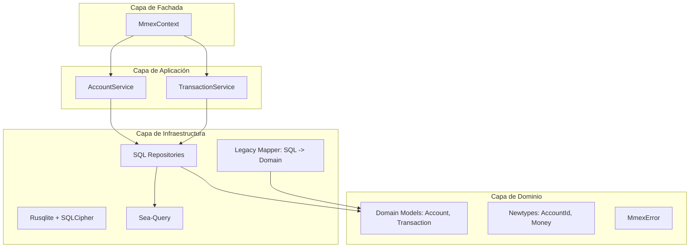

# mmex_lib: Arquitectura y Diseño Técnico

Este documento detalla la arquitectura de `mmex_lib`, una librería en Rust diseñada para interactuar con bases de datos de Money Manager EX (MMEX).

## 1. Filosofía de Diseño

*   **Pure-Core & Sync:** 100% sincrónica. Sin dependencias de runtimes asíncronos (Tokio/async-std). Optimizada para FFI (C/C++), aplicaciones de escritorio y CLI.
*   **Domain-Driven Design (DDD):** El dominio es el centro. La base de datos es un detalle de implementación.
*   **Type Safety:** Uso intensivo de *Newtypes* para IDs y `rust_decimal` para evitar errores de precisión de coma flotante.
*   **Legacy Mapping:** Abstracción total del esquema SQL legacy (tablas como `ACCOUNTLIST_V1`, `CHECKINGACCOUNT_V1`) hacia un modelo de dominio moderno y semántico.

## 2. Arquitectura de Capas (DDD)



---

## 3. Capa de Dominio (Domain)

### Tipos Fuertes (Newtypes)
Para evitar la "Primitive Obsession" y asegurar que no mezclemos IDs de diferentes entidades.

```rust
pub struct AccountId(i32);
pub struct TransactionId(i32);
pub struct Money(rust_decimal::Decimal);
```

### Modelos de Dominio
Las entidades contienen lógica de negocio y validación, no solo datos.

```rust
pub struct Account {
    id: AccountId,
    name: String,
    account_type: AccountType,
    initial_balance: Money,
    // ...
}

impl Account {
    pub fn new(name: &str, initial: Money) -> Result<Self, MmexError> {
        if name.trim().is_empty() {
            return Err(MmexError::Validation("Account name cannot be empty".into()));
        }
        // Lógica de creación inicial
    }
}
```

---

## 4. Gestión de Transacciones de Base de Datos

Para manejar transacciones sin acoplar el dominio a `rusqlite`, implementaremos el patrón **Executor trait**. Los servicios y repositorios trabajarán contra una abstracción de "capacidad de ejecución".

```rust
/// Abstracción que puede ser una conexión directa o una transacción activa.
pub trait DbExecutor {
    fn query_row<T, P, F>(&self, sql: &str, params: P, f: F) -> Result<T, MmexError>
    where
        P: Params,
        F: FnOnce(&Row<'_>) -> rusqlite::Result<T>;
    
    fn execute<P>(&self, sql: &str, params: P) -> Result<usize, MmexError>
    where P: Params;
}
```

---

## 5. Estrategia de Mapeo Legacy

El esquema de MMEX usa nombres de tablas versionados. La referencia técnica absoluta para este esquema es el archivo `tables.sql`, el cual define la estructura de las tablas `V1`. La infraestructura usará `sea-query` para construir consultas dinámicas que referencien estas tablas, mapeando los resultados a estructuras de dominio limpias.

| Tabla Legacy | Concepto de Dominio |
| :--- | :--- |
| `ACCOUNTLIST_V1` | `Account` |
| `CHECKINGACCOUNT_V1` | `Transaction` |
| `CATEGORY_V1` | `Category` |
| `CURRENCYFORMATS_V1` | `Currency` |

---

## 6. Gestión de Errores

Utilizaremos `thiserror` para un sistema de errores jerárquico y claro.

```rust
#[derive(thiserror::Error, Debug)]
pub enum MmexError {
    #[error("Database error: {0}")]
    Database(#[from] rusqlite::Error),

    #[error("Encryption error: {0}")]
    Crypto(String),

    #[error("Validation error: {0}")]
    Validation(String),

    #[error("Entity not found: {0}")]
    NotFound(String),

    #[error("Mapping error from legacy schema: {0}")]
    LegacyMapping(String),
}
```

---

## 7. Public API: MmexContext

El `MmexContext` actúa como el punto de entrada principal (Facade). Encapsula la conexión a la base de datos y provee acceso a los servicios de aplicación.

```rust
pub struct MmexContext {
    conn: rusqlite::Connection,
}

impl MmexContext {
    pub fn open(path: &Path, key: Option<&str>) -> Result<Self, MmexError> {
        // 1. Abrir conexión con rusqlite
        // 2. Si hay key, ejecutar PRAGMA key para SQLCipher
        // 3. Validar integridad de la base de datos
    }

    pub fn account_service(&self) -> AccountService<'_> {
        AccountService::new(&self.conn)
    }
}
```

---

## 8. Estrategia de Testing

1.  **Unit Tests:** Localizados en los módulos de `domain`, probando lógica pura sin efectos de lado.
2.  **Integration Tests:**
    *   Uso de bases de datos SQLite en memoria (`:memory:`).
    *   Scripts SQL para cargar el esquema legacy mínimo necesario.
    *   Verificación de que los cálculos con `rust_decimal` coincidan con las expectativas de MMEX.
