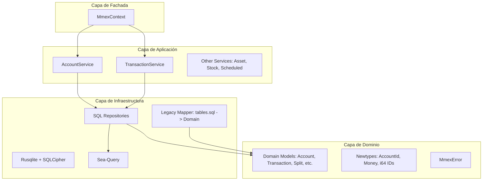

# mmex_lib: Arquitectura y Diseño Técnico

Este documento detalla la arquitectura de `mmex_lib`, una librería en Rust diseñada para interactuar con bases de datos de Money Manager EX (MMEX).

## 1. Filosofía de Diseño

*   **Pure-Core & Sync:** 100% sincrónica. Sin dependencias de runtimes asíncronos (Tokio/async-std). Optimizada para FFI (C/C++), aplicaciones de escritorio y CLI.
*   **Domain-Driven Design (DDD):** El dominio es el centro. La base de datos es un detalle de implementación.
*   **Type Safety:** Uso intensivo de *Newtypes* para IDs (`i64`) y `rust_decimal` para evitar errores de precisión de coma flotante.
*   **Legacy Mapping:** Abstracción total del esquema SQL legacy definido en `tables.sql` hacia un modelo de dominio moderno y semántico.

## 2. Arquitectura de Capas (DDD)



---

## 3. Capa de Dominio (Domain)

### Tipos Fuertes (Newtypes)
Todos los identificadores utilizan `i64` para soportar bases de datos de gran volumen.

```rust
pub struct AccountId(pub i64);
pub struct TransactionId(pub i64);
pub struct Money(pub rust_decimal::Decimal);
```

### Modelos de Dominio
Las entidades reflejan fielmente el esquema de `tables.sql` pero con tipos de Rust seguros (Enums, Options).

---

## 4. Gestión de Transacciones de Base de Datos

Implementamos el patrón **Executor trait** para manejar Conexiones y Transacciones de forma transparente para los servicios.

---

## 5. Estrategia de Mapeo Legacy

La referencia técnica absoluta para el esquema es el archivo `tables.sql`. La infraestructura usa `sea-query` para construir consultas dinámicas que referencien estas tablas (`V1`), mapeando los resultados a estructuras de dominio limpias.

| Tabla Legacy | Concepto de Dominio |
| :--- | :--- |
| `ACCOUNTLIST_V1` | `Account` |
| `CHECKINGACCOUNT_V1` | `Transaction` |
| `CATEGORY_V1` | `Category` |
| `CURRENCYFORMATS_V1` | `Currency` |
| `SPLITTRANSACTIONS_V1`| `SplitTransaction` |
| `BILLSDEPOSITS_V1` | `ScheduledTransaction` |
| `ASSETS_V1` | `Asset` |
| `STOCK_V1` | `Stock` |

---

## 6. Gestión de Errores

Sistema basado en `thiserror` que distingue errores de validación, base de datos y mapeo de tipos legacy.

---

## 7. Public API: MmexContext

El `MmexContext` es el punto de entrada principal (Facade) que gestiona la conexión SQLite + SQLCipher y expone todos los servicios.

---

## 8. Estrategia de Testing

1.  **Integration Tests:** Todos los tests de integración deben cargar `tables.sql` en una base de datos `:memory:` para garantizar la paridad con el esquema real.
