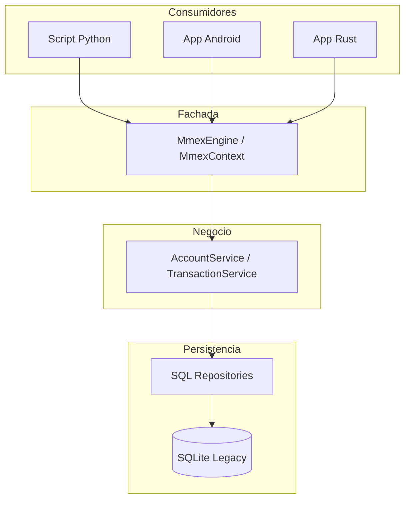

# Arquitectura de mmex_lib 🏗️

Este documento describe la estructura y los principios de diseño de `mmex_lib`, una biblioteca en Rust diseñada para ser el núcleo multiplataforma de Money Manager EX.

## 1. Filosofía de Diseño

-   **Pure-Core & Sync**: 100% sincrónica para máxima compatibilidad con FFI (C/C++), aplicaciones de escritorio y móviles sin necesidad de runtimes asíncronos pesados (como Tokio).
-   **Domain-Driven Design (DDD)**: El dominio es el centro. La base de datos y la interfaz de usuario son detalles de implementación.
-   **Type Safety**: Uso intensivo de *Newtypes* para IDs y `rust_decimal` para evitar errores de precisión financiera.
-   **Multiplataforma (UniFFI)**: Diseñada para ser consumida desde Python, Kotlin (Android), Swift (iOS) y C++ desde un único código base en Rust.

---

## 2. Capas de la Aplicación (DDD)

La arquitectura se divide en cuatro capas principales:

### 1. Capa de Dominio (`src/domain/`)
-   **Modelos**: Definición de entidades (`Account`, `Transaction`, `Category`).
-   **Tipos**: Tipos de datos seguros (`AccountId`, `Money`, `MmexError`).
-   **Interfaces**: Definición de los contratos (traits) de los repositorios.
-   *Es agnóstica de la base de datos y de la interfaz externa.*

### 2. Capa de Infraestructura (`src/infrastructure/`)
-   **Repositorios**: Implementación de los traits de dominio (ej: `SqlAccountRepository` en `repositories.rs`, `SqlTransactionRepository` en `transactions_repository.rs`).
-   **Mapeadores**: Conversión de filas de SQLite legacy (`tables.sql`) a modelos de dominio (ubicados en `mapper.rs` y dentro de los repositorios).
-   **Herramientas**: Uso de `sea-query` con `Alias` para la construcción dinámica de SQL compatible con el esquema legacy.
-   *Es la única capa que conoce el esquema legacy de la base de datos.*

### 3. Capa de Servicios (`src/services/`)
-   **Lógica de Negocio**: Coordina los repositorios para realizar operaciones complejas (ej: realizar una transferencia entre cuentas, calcular balances históricos).
-   **Validaciones**: Reglas de negocio que no pertenecen a una entidad individual.

### 4. Capa de API y FFI (`src/api/` & `src/ffi/`)
-   **`MmexContext`**: Fachada principal para el uso en Rust.
-   **`MmexEngine`**: Fachada exportada vía UniFFI para su uso en Python, Kotlin y Swift.
-   **Managers**: Objetos especializados (ej: `AccountManager`, `TransactionManager`) expuestos a otros lenguajes.

---

## 3. Flujo de Datos

---

## 4. Gestión de Estado y Concurrencia

-   **Thread-Safety**: En la capa FFI, el contexto se gestiona mediante `Arc<Mutex<MmexContext>>`. Esto garantiza que la conexión a la base de datos sea segura para hilos en entornos multi-hilo (como aplicaciones móviles).
-   **Conexiones**: Se mantiene una única conexión SQLite abierta durante el ciclo de vida del `MmexEngine`, optimizada con SQLCipher para bases de datos cifradas.

---

## 5. Próximos Pasos Arquitectónicos

-   **Caching**: Implementación de una capa de caché para balances y tasas de cambio.
-   **Soporte Async (Opcional)**: Evaluación de envoltorios asíncronos para operaciones de red (descarga de tasas).
-   **Notificaciones**: Sistema de eventos internos para notificar cambios en el estado de la base de datos.
